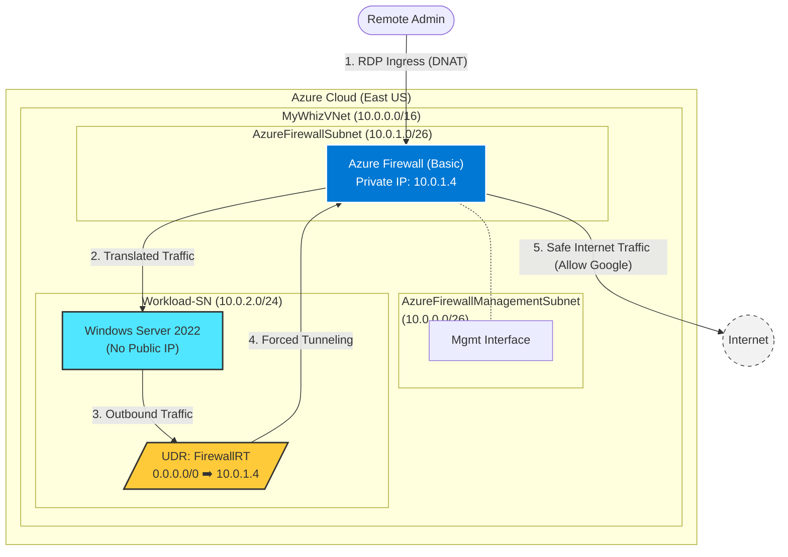

```markdown
# Azure Firewall Deployment and Configuration: Enterprise Network Security Implementation


## Introduction

In this project, I demonstrate the deployment and configuration of **Azure Firewall** as a cloud-native network security service, implementing a complete security perimeter for Azure workloads. This comprehensive implementation showcases the transition from an unprotected virtual network to a fully secured environment with centralized traffic inspection, application-level filtering, and secure remote access capabilities.

The project follows Microsoft's cloud security best practices and demonstrates practical implementation of defense-in-depth strategies, including network segmentation, traffic filtering, forced tunneling, and security policy enforcement. This architecture serves as a foundation for enterprise-grade cloud security implementations in production environments.

## Objectives

- Deploy Azure Firewall with forced tunneling support for enhanced security
- Configure Virtual Network infrastructure with proper subnet segmentation
- Implement application rules for FQDN-based filtering
- Establish network rules for protocol-level access control
- Configure DNAT rules for secure remote access to internal resources
- Create custom routing to force all traffic through the firewall
- Validate security policies through comprehensive testing

## Tech Stack


- **Azure Firewall (Basic SKU)** - Cloud-native network security service
- **Azure Virtual Network** - Isolated network infrastructure
- **Azure Virtual Machine** - Windows Server 2022 for workload testing
- **Azure Route Tables** - Custom routing for traffic inspection
- **Firewall Policy** - Centralized rule management
- **Network Security** - DNS configuration and traffic control

## Architecture Overview

### Deployment Architecture



The architecture implements a hub-and-spoke network topology with centralized security:

**Network Layer:**

* Virtual Network (10.0.0.0/16) with segmented subnets
* **AzureFirewallSubnet** (10.0.1.0/26) for firewall data plane
* **AzureFirewallManagementSubnet** (10.0.0.0/26) for forced tunneling
* **Workload-SN** (10.0.2.0/24) for application servers

**Security Layer:**

* Azure Firewall with dual public IPs (data and management)
* Firewall Policy with application, network, and DNAT rules
* Custom DNS servers for secure name resolution
* Route table forcing all traffic through firewall

**Traffic Flow:**

1. All outbound traffic from Workload-SN → Route Table → Azure Firewall → Internet
2. Inbound RDP traffic → Firewall Public IP → DNAT → VM Private IP
3. DNS queries → Firewall → Custom DNS servers (209.244.0.3, 209.244.0.4)

## Implementation Steps

### Phase 1: Virtual Network Infrastructure Deployment

Created a segmented virtual network to support Azure Firewall and workload isolation.

**Subnet Design:**

| Subnet Name | Address Range | Purpose |
| --- | --- | --- |
| AzureFirewallSubnet | 10.0.1.0/26 | Firewall data plane |
| AzureFirewallManagementSubnet | 10.0.0.0/26 | Firewall management plane |
| Workload-SN | 10.0.2.0/24 | Application workloads |

*Figure 1: Configuring Virtual Network IP address space and the Data plane subnet*

*Figure 2: Adding the dedicated Management Subnet for forced tunneling*

### Phase 2: Virtual Machine Deployment for Testing

Deployed a Windows Server VM in the workload subnet to test firewall policies and connectivity.

**VM Specifications:**

* **Name:** Srv-Workload
* **OS:** Windows Server 2022 Datacenter
* **Network:** Workload-SN (10.0.2.0/24)
* **Security:** Boot diagnostics disabled; No public IP assigned directly (access via DNAT).

*Figure 3: Successful deployment of the workload VM*

### Phase 3: Azure Firewall and Policy Deployment

Deployed Azure Firewall with Basic SKU and created a centralized firewall policy for rule management.

**Firewall Configuration:**

* **Name:** MyFirewallTest
* **SKU:** Basic
* **Policy:** MyPolicy
* **Public IPs:** Separate IPs for Data (DNAT/SNAT) and Management (Forced Tunneling).

*Figure 4: Azure Firewall resources successfully deployed*

### Phase 4: Custom Route Table Configuration

Created a route table to force all outbound traffic from the workload subnet through Azure Firewall for inspection.

**Route Configuration:**

| Route Name | Address Prefix | Next Hop Type | Next Hop Address |
| --- | --- | --- | --- |
| MyRoute | 0.0.0.0/0 | Virtual Appliance | 10.0.1.4 |

**How It Works:**

1. VM in Workload-SN initiates outbound connection.
2. Route table matches 0.0.0.0/0 (all internet traffic).
3. Traffic is redirected to the firewall's private IP (10.0.1.4) instead of going directly to the internet.

*Figure 5: Route Table overview showing the 'Virtual Appliance' next hop*

*Figure 6: Associating the Route Table with the Workload subnet*

### Phase 5: Application Rule Configuration

Implemented Layer 7 filtering to control which websites and applications workloads can access.

**Rule: Allow-Google**

* **Source:** 10.0.2.0/24
* **Protocol:** HTTP, HTTPS
* **Target FQDN:** `www.google.com`
* **Action:** Allow

**Security Benefit:** Enables granular FQDN filtering, ensuring workloads can only access approved domains (Whitelisting).

*Figure 7: Configuring Application Rule to allow access to Google only*

### Phase 6: Network Rule Configuration

Configured Layer 4 filtering to allow DNS queries from the workload subnet to specific DNS servers (Quad9).

**Rule: Allow-DNS**

* **Protocol:** UDP
* **Port:** 53
* **Destination:** 209.244.0.3, 209.244.0.4

**Why This Matters:** Without this rule, the VM cannot resolve domain names to IP addresses, rendering the Application Rules useless.

*Figure 8: Configuring Network Rule to allow DNS traffic*

### Phase 7: DNAT Rule Configuration

Configured Destination Network Address Translation (DNAT) to enable secure RDP access to the VM through the firewall's public IP.

**Rule: rdp-nat**

* **Protocol:** TCP
* **Port:** 3389
* **Destination:** [Firewall Public IP]
* **Translated Address:** 10.0.2.x (VM Private IP)

**Security Benefit:** The VM does not need a public IP address. All access is proxied and logged through the firewall.

*Figure 9: DNAT Rule configuration for secure RDP access*

### Phase 8: DNS Configuration on VM

Configured the VM's network interface to use the specific DNS servers allowed in Phase 6 (209.244.0.3, 209.244.0.4). This ensures DNS queries are routed correctly and match the firewall rules.

## Testing and Validation

### 1. RDP Access via DNAT

**Test:** Initiated RDP connection to the Firewall's Public IP.
**Result:** ✅ Success. Connection was forwarded to the internal VM.

### 2. Application Whitelisting

**Test:** Browsed to `www.google.com`.
**Result:** ✅ Success. Page loaded (matched Application Rule).

**Test:** Browsed to `www.microsoft.com`.
**Result:** ❌ Blocked. "Connection timed out" (Implicit Deny).

### 3. DNS Resolution

**Test:** `nslookup www.google.com`
**Result:** ✅ Success. Resolved via Quad9 servers through the firewall.

## Key Results

* **Security Controls:** 7 major security controls implemented (Segmentation, Firewall, Forced Tunneling, App Rules, Net Rules, DNAT, Custom DNS).
* **Zero Trust:** Achieved a "Deny by Default" posture where only explicitly allowed traffic is permitted.
* **Attack Surface Reduction:** Eliminated public IP exposure for the workload VM.
* **Traffic Visibility:** All inbound and outbound traffic is now inspected and logged by Azure Firewall.

## Architectural Best Practices Demonstrated

**1. Defense in Depth**

* Network segmentation (VNet and subnets)
* Firewall inspection (application and network rules)
* DNS security (controlled name resolution)
* Address translation (hiding internal addresses)

**2. Zero Trust Network Access**

* Default deny posture for all traffic
* Explicit allow rules for required access
* Validation of every connection attempt

**3. Least Privilege Access**

* VMs have no direct internet access
* Only required protocols allowed (HTTP, HTTPS, DNS)
* Only required destinations allowed (Google, DNS servers)

**4. Centralized Security Management**

* Single firewall for all traffic inspection
* Unified logging and monitoring point

## Key Takeaways & Lessons Learned

**What I Learned:**

1. **Subnet Naming is Critical:** Azure Firewall requires specifically named subnets (`AzureFirewallSubnet` and `AzureFirewallManagementSubnet`) or deployment fails.
2. **Rule Priority Matters:** Lower priority numbers are evaluated first. Explicit deny rules should usually have higher priority (lower number) than allow rules.
3. **DNS is Make-or-Break:** Without custom DNS on the VM matching the firewall Network Rule, FQDN-based application rules will fail to resolve.
4. **Forced Tunneling Security:** Using a dedicated Management Subnet separates control plane traffic from data plane traffic, a key requirement for high-security environments.

## Production Implementation Recommendations

**Immediate Actions:**

* ✅ Implement Azure Firewall in all production Virtual Networks.
* ✅ Use Firewall Policy for centralized rule management.
* ✅ Configure diagnostic logging to Log Analytics workspace.
* ✅ Restrict DNAT source IPs to corporate networks only (no `Source: *`).

**Advanced Hardening:**

* **Upgrade to Standard/Premium:** For TLS inspection and IDPS (Intrusion Detection/Prevention).
* **Threat Intelligence:** Enable "Alert and Deny" mode for known malicious IPs.
* **Azure Bastion:** Replace RDP DNAT rules with Azure Bastion for browser-based access without opening ports.

## Common Pitfalls to Avoid

❌ **Don't apply route tables to AzureFirewallSubnet** - Causes routing loops.
❌ **Don't forget VM restart after DNS changes** - DNS changes require a restart to take effect.
❌ **Don't use /27 or smaller for firewall subnets** - Minimum /26 is required by Azure.
❌ **Don't allow source: * in production DNAT rules** - Restrict to known IPs.
❌ **Don't skip forced tunneling in production** - Management traffic should be controlled.

## Cost Optimization Strategies

**Azure Firewall Pricing Considerations:**

* **Fixed Cost:** Deployment charge per hour (~$1.25/hour for Basic SKU).
* **Data Processing:** Charge per GB processed.
* **Estimated Lab Cost:** ~$900/month if left running (Basic SKU).

**Cost Reduction Options:**

* **Deallocate Resources:** Always delete the Firewall resource when not in active use in a lab environment.
* **Use Basic SKU:** The Basic SKU is ~50% cheaper than Standard, making it ideal for SMBs and testing.

## About This Project

**Role:** Cloud Security Engineer
**Skills Demonstrated:** Azure Networking, Infrastructure Security, Firewalls, Routing, Compliance, Zero Trust Architecture.

```

```